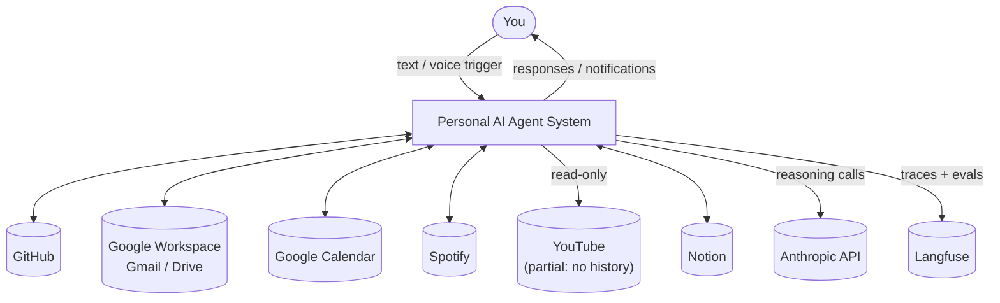
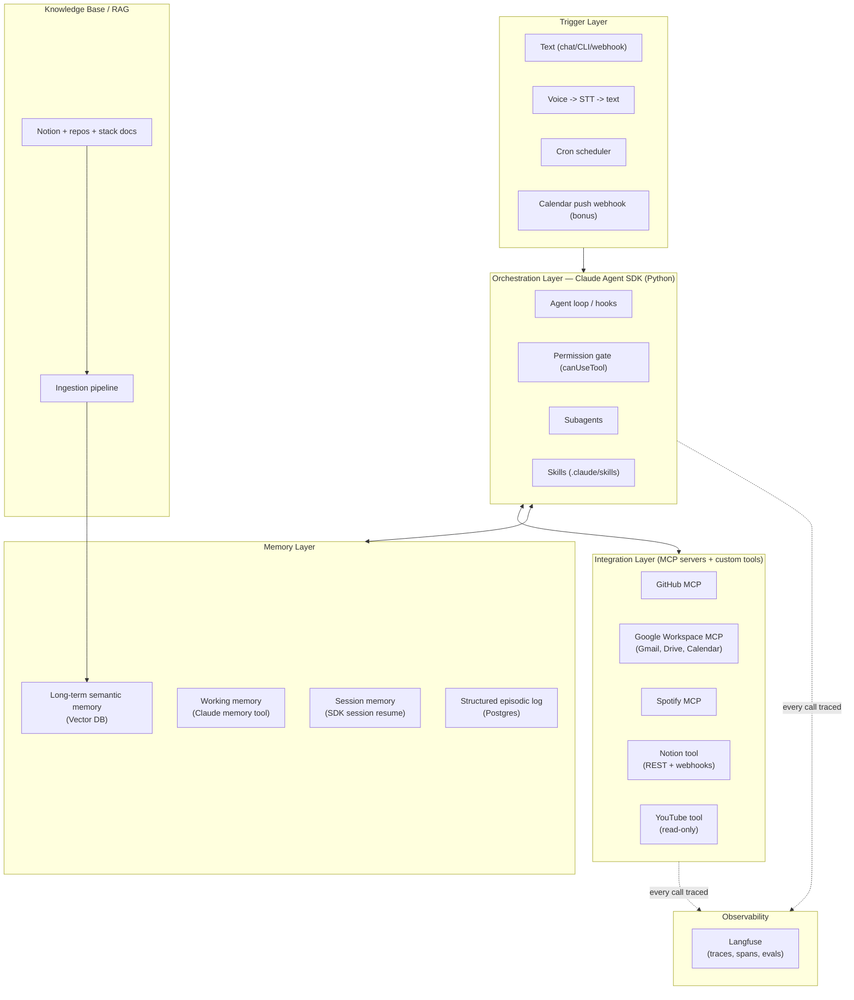
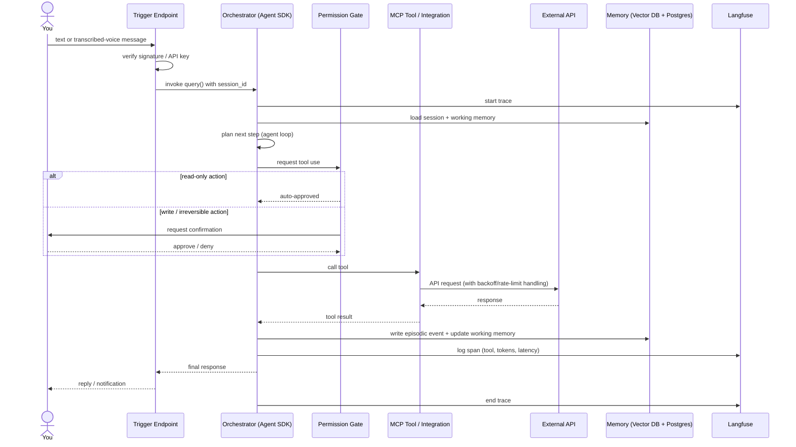
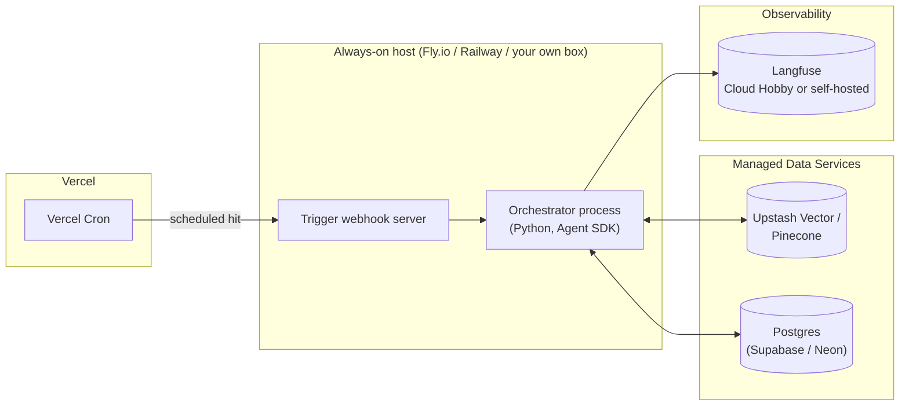
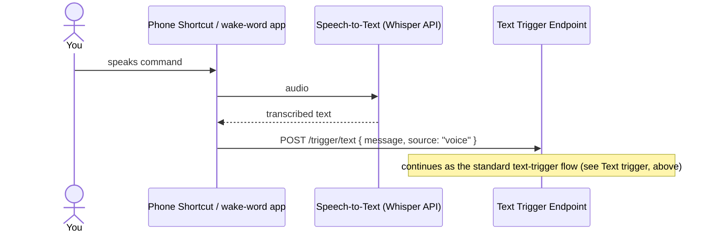
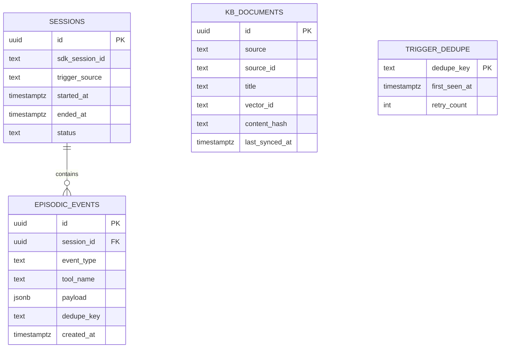
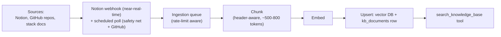
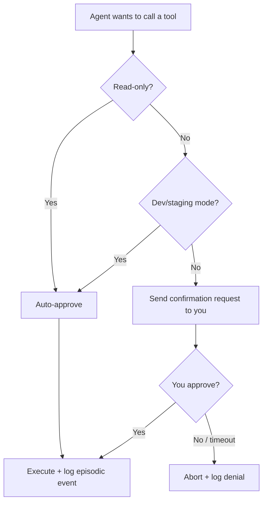

# rocky

A personal AI agent, built with the [Claude Agent SDK](https://platform.claude.com/docs/en/agent-sdk/overview),
phase by phase per the [Suggested Build Order](#suggested-build-order) below.
Each `tasks/NN-*.md` file scopes one phase; the rest of this repo is the
running code. Purpose: learn how production-grade agents are architected, by
building one for yourself — not to ship a polished consumer product.

One naming note: the "Claude Code SDK" was renamed the **Claude Agent SDK**
(`claude-agent-sdk` on PyPI for Python). It's a library — you host and run it
yourself, in your own process.

## Setup

```bash
python3.12 -m venv .venv
.venv/bin/pip install -r requirements.txt
cp .env.example .env  # then fill in whichever phase you're running
```

Requires Python 3.10+ (`claude-agent-sdk` won't install on older versions).

## Run

Each phase has its own entrypoint, for testing one integration in
isolation. Fill in only the `.env` vars the phase you're running needs —
every entrypoint guards on its own required config and fails with a clear
message (not a stack trace) if something's missing.

| Phase | Entrypoint | Task doc | Needs in `.env` |
|---|---|---|---|
| 1 — Foundations | `main.py` | [tasks/01-foundations.md](tasks/01-foundations.md) | nothing required (falls back to the local `claude` CLI login) |
| 2 — Notion | `notion_main.py` | [tasks/02-notion-integration.md](tasks/02-notion-integration.md) | `NOTION_TOKEN`, `NOTION_ROOT_PAGE_ID` |
| 3 — GitHub | `github_main.py` | [tasks/03-github-integration.md](tasks/03-github-integration.md) | `GITHUB_TOKEN` |
| 6 — Gmail/Drive/Calendar/YouTube | `agent_main.py` | [tasks/06-remaining-integrations.md](tasks/06-remaining-integrations.md) | `GOOGLE_CLIENT_ID`, `GOOGLE_CLIENT_SECRET` |
| 6 — Spotify | `agent_main.py` | [tasks/06-remaining-integrations.md](tasks/06-remaining-integrations.md) | `SPOTIFY_CLIENT_ID`, `SPOTIFY_CLIENT_SECRET` |

```bash
.venv/bin/python main.py           # Phase 1 only
.venv/bin/python notion_main.py    # Phase 2 only
.venv/bin/python github_main.py    # Phase 3 only
.venv/bin/python agent_main.py     # everything configured in .env, together, interactively
```

**`agent_main.py`** is the one meant for testing everything together: it's
an interactive REPL that wires up whichever integrations have their config
present in `.env` and tells you which ones it skipped and why, so you can
test with any subset filled in — you don't need all seven credentials to
try it. Google (Gmail/Drive/Calendar/YouTube) and Spotify each open a
one-time browser consent flow on first use and cache the resulting token
(`.google_token.json` / `.spotify_token.json`, both gitignored).

**Why custom tools instead of GitHub's hosted-MCP pattern for everything:**
GitHub, Notion, and Google (Gmail/Drive/Calendar) all now ship official MCP
servers, so it's fair to ask why only GitHub is wired as a remote MCP server
while the rest are custom `tools/*.py` wrappers around each service's REST
API. Checked as of 2026-08:
- **Notion**: the official *hosted* server (`mcp.notion.com`) is OAuth-only;
  the official *self-hosted* one (`makenotion/notion-mcp-server`) takes the
  same static internal-integration-token this repo already uses, but runs
  via `npx` — an extra Node.js runtime dependency for no functional gain
  over the pure-Python client already here.
- **Gmail/Drive/Calendar**: Google's hosted MCP servers
  (`gmailmcp.googleapis.com` etc.) are all in **Developer Preview**, not GA
  — they require enrolling in Google's [Workspace Developer Preview
  Program](https://developers.google.com/workspace/preview) before they
  work at all. Gmail's is also **draft-only** (`create_draft`, no
  `send_message`), which would drop this repo's `gmail_send` tool entirely.

Re-evaluate this if those servers reach GA, or if the Developer Preview
Program becomes easy to enroll in and Gmail gains send support.

Set `LANGFUSE_PUBLIC_KEY`/`LANGFUSE_SECRET_KEY` to trace any run in
Langfuse; every entrypoint runs untraced (not broken) without them.

Every write-tier tool call (Notion page creation, GitHub issue/PR writes,
Gmail send, Calendar event creation, ...) is gated by
`hooks/permission_gate.py`: it prints the tool call and blocks on a
`y/N` terminal prompt before running. Read-only calls auto-approve. See that
file's `RISK_TIERS` table for the exact classification, and its module
docstring for why unclassified tools default to "ask" rather than silent
allow. Set `AGENT_MODE=dev` to auto-approve writes too (see
[Security and Permission Tiers](#security-and-permission-tiers)) — useful
for a fast test pass, but it defaults to `prod` (always ask) so you have to
opt into the looser mode explicitly. `agent_main.py` also enforces
`DAILY_SPEND_CAP_USD` (default $5/day) via `tools/cost_guard.py`, checked
before every turn.

## Layout

```
rocky/
├── README.md                       # this file — setup, usage, and full design docs
├── tasks/                          # one scoped planning doc per build phase
├── main.py                         # Phase 1: hello-world query
├── notion_main.py                  # Phase 2: Notion tools + permission gate
├── github_main.py                  # Phase 3: GitHub MCP + permission gate
├── agent_main.py                   # Phase 6 / unified: every configured integration, interactively
├── hooks/
│   └── permission_gate.py          # shared risk-tier table + canUseTool + dev-mode switch, all phases
├── .claude/
│   ├── skills/                      # empty until Phase 8
│   └── subagents/                   # researcher.py lands in Phase 8
├── tools/
│   ├── notion_client.py             # rate-limited Notion REST client
│   ├── notion_tool.py               # Notion SDK tool wrappers + MCP server
│   ├── google_auth.py               # shared Google OAuth2 helper (Gmail/Drive/Calendar/YouTube)
│   ├── gmail_tool.py                # gmail_search (read), gmail_send (write)
│   ├── drive_tool.py                # drive_search (read-only scope)
│   ├── calendar_tool.py             # calendar_list_events (read), calendar_create_event (write)
│   ├── youtube_tool.py              # subscriptions/playlists/liked videos (read-only scope)
│   ├── spotify_client.py            # Spotify OAuth2 (Authorization Code) helper
│   ├── spotify_tool.py              # currently-playing/recently-played/playlists (read-only)
│   └── cost_guard.py                # daily spend cap ledger, used by agent_main.py
├── mcp_servers.json                 # reference only — entrypoints build MCP configs in Python from env vars, not this file
└── memories/                        # Claude memory-tool working directory — Phase 4
```

---

# Design

The sections below are the full technical design this build follows —
system context, architecture, and the detailed spec for each layer. It's
organized as high-level design, low-level design, then the delivery plan
that the phase table above and each `tasks/*.md` file are drawn from.

## High-Level Design

### System Context



The agent sits between you and seven external systems. Everything it does is either a reaction to something you (or your calendar) triggered, or a scheduled sweep — there is no autonomous background agency beyond what [Security and Permission Tiers](#security-and-permission-tiers)' permission tiers allow.

### High-Level Architecture



**Why this shape:** the orchestrator never talks to Gmail/Spotify/Notion directly — everything routes through the integration layer, so each source is swappable and independently testable. Memory is split into four tiers because they solve four different problems (see [Memory Layer](#memory-layer)). Every call, in every layer, is traced through Langfuse.

### Component Responsibility Summary

| Component | Responsibility | Owns |
|---|---|---|
| Trigger layer | Accept text/voice/scheduled input, authenticate it, hand it to the orchestrator | Webhook auth, STT hop, cron definitions |
| Orchestrator | Run the agent loop: plan, call tools, decide when done | Session state, permission decisions, hook execution |
| Integration layer | Talk to external APIs, normalize responses into tool results | OAuth/token handling per service, rate-limit backoff |
| Memory layer | Persist and retrieve state across turns and sessions | Vector DB, Postgres, memory-tool files |
| Knowledge base | Keep a searchable, current copy of your stack + Notion | Ingestion pipeline, chunking, embeddings |
| Observability | Make every decision inspectable after the fact | Langfuse traces, eval datasets |

### Technology Stack Summary

| Layer | Choice | Why |
|---|---|---|
| Orchestration | Claude Agent SDK (Python) | Native hooks/subagents/skills/MCP/permissions |
| Trigger/webhook host | Small always-on VM (Fly.io / Railway) or a cloud VM | Long tool-calling loops don't fit serverless timeouts (see [Orchestration Layer](#orchestration-layer)'s process model) |
| Scheduling | Vercel Cron or GitHub Actions scheduled workflow | Free, no extra infra, fires the trigger endpoint |
| Vector DB | Upstash Vector (primary) or Pinecone Starter | Both native Vercel Marketplace integrations, usable free tier |
| Structured store | Postgres (Supabase or Neon free tier) | Episodic log, dedupe table, KB document index |
| STT | Whisper API (or equivalent) | Only practical way to get voice into a text-only agent input |
| Observability | Langfuse Cloud Hobby, or self-hosted compose | Native Anthropic SDK instrumentation |

### End-to-End Data Flow

Generic trigger → response:



**Voice adds one hop before this diagram starts:** phone Shortcut/wake-word app → Whisper API → transcribed text → the trigger endpoint above, unchanged from there.

### Deployment Topology



Notion being a cloud API — not a local file vault — means there's no local-filesystem dependency forcing the orchestrator onto a particular machine. A small always-on cloud VM is the simplest default unless you already have a home server running for other reasons.

## Low-Level Design

### Orchestration Layer

Agent SDK, Python.

**Process model:** one long-running Python process (not a serverless function) hosting the trigger webhook server and the Agent SDK client. A single process is enough at personal scale — no need for a job queue/worker split yet.

**Session lifecycle:**

| Event | Behavior |
|---|---|
| New trigger, no existing session for the context (e.g. "morning digest") | Start a fresh SDK session |
| Follow-up within the same conversation/task | Resume the existing `session_id` |
| Task spans multiple days (e.g. "keep researching X") | Fork a session at a checkpoint so the original stays resumable |
| Context approaching the clearing threshold | Memory-tool write triggered automatically (per Anthropic's context-editing behavior) before old tool results are cleared |

**Directory layout** (design-time sketch — see [Layout](#layout) above for what's actually built so far):

```
main.py                   # trigger webhook server + SDK client wiring
hooks/
└── permission_gate.py
.claude/
├── skills/
│   ├── triage-inbox/SKILL.md
│   ├── weekly-github-digest/SKILL.md
│   ├── notion-capture/SKILL.md
│   └── spotify-mood-playlist/SKILL.md
└── subagents/
    └── researcher.py
tools/                    # custom (non-MCP) tools, e.g. Notion client, memory writer
mcp_servers.json          # MCP server registrations (GitHub, Google Workspace, Spotify)
memories/                 # Claude memory-tool working directory
```

**Permission gate contract** (`canUseTool` callback — conceptual signature, not implementation):

| Input | Output |
|---|---|
| Tool name, arguments, classified risk tier (read / write / destructive) | `allow`, `deny`, or `ask` (blocks on your confirmation via the trigger channel) |

Risk-tier classification is a static table you maintain per tool (e.g. `gmail.search` → read, `gmail.send` → ask, `notion.delete_page` → ask), not something the model decides about itself.

### Trigger Layer

#### Text trigger

| Field | Spec |
|---|---|
| Endpoint | `POST /trigger/text` |
| Auth | HMAC signature or bearer API key, checked before touching the SDK |
| Request body | `{ "message": string, "source": "manual" \| "shortcut" \| "bot", "session_hint": string? }` |
| Response | `{ "session_id": string, "reply": string, "trace_url": string }` |

#### Voice trigger



#### Cron-scheduled jobs

| Job | Frequency | What it does |
|---|---|---|
| Morning digest | Daily | Summarize overnight email/GitHub activity, post to your text channel |
| Notion incremental sync | Every few hours (safety-net poll alongside webhooks — see [Notion integration deep dive](#notion-integration-deep-dive)) | Catch any Notion changes the webhook missed |
| GitHub/repo re-index | Daily | Refresh knowledge-base embeddings for changed files |
| Calendar watch renewal | Every ~25 days | Google Calendar push-notification channels expire at 30 days — renew before that |
| Memory hygiene | Weekly | Expire/archive old episodic events and stale vector entries per your retention policy (see [Security and Permission Tiers](#security-and-permission-tiers)) |

#### Calendar push webhook (bonus trigger)

Registered via the Calendar API's `watch()` call. On event create/update, Google POSTs a near-empty notification (not the event content) to your webhook — the handler then makes a follow-up `events.get` call to fetch details before deciding whether to act. Treat this purely as an *additional* trigger layered on top of the cron jobs above — never the primary scheduler.

### Integration Layer

| Integration | Access method | Auth | Key scopes / tools | Write actions gated? |
|---|---|---|---|---|
| GitHub | Official GitHub MCP server | GitHub App or PAT | repo, issues, PRs (read); comment/PR-create (write) | Yes |
| Gmail | Google Workspace MCP | OAuth 2.0 (Desktop app client) | `gmail.readonly` default; `gmail.send` only if needed | Yes |
| Google Drive | Google Workspace MCP | OAuth 2.0 | `drive.readonly` default | Yes |
| Google Calendar | Google Workspace MCP | OAuth 2.0 | `calendar.readonly` + `calendar.events` for the watch channel | Yes (event creation) |
| Spotify | Community Spotify MCP | OAuth 2.0 (Authorization Code) | `user-read-currently-playing`, `user-read-recently-played`, `playlist-read-private` | N/A (read-only use case) |
| Notion | Custom tool or lightweight MCP (see [Notion integration deep dive](#notion-integration-deep-dive)) | Internal integration token | Page/database read; page create/update (write) | Yes |
| YouTube | Google API client, separate OAuth scope | OAuth 2.0 | `youtube.readonly` — liked videos, playlists, subscriptions only | N/A (read-only) |

#### Notion integration deep dive

This is worth its own subsection because the Notion API changed significantly through 2026 and the details affect the design:

- **Auth:** for a single-workspace personal agent, an **internal integration token** is simpler than OAuth — no consent flow, just a token from Notion's integration settings. The trade-off is Notion's permission model: the integration only sees pages/databases you've explicitly *shared with it*. Practical fix — create one top-level "Agent Access" page, share that with the integration, and organize everything the agent should see as children of it, so new pages inherit access instead of needing to be shared one by one.
- **Data model:** since the 2025-09-03 API version, a Notion "database" is a container that can hold multiple **data sources** — most query/write calls now need a `data_source_id`, fetched via a lookup call, not just the `database_id` you'd expect from older docs or tutorials. Build the Notion tool against the current API version from day one; don't copy a pre-2025 code sample.
- **Rate limit:** ~3 requests/second average per integration, with 429s on bursts — and because reading one page fans out into several calls (page → block children → nested blocks), a real sync of a non-trivial workspace needs a small request queue with exponential backoff, not naive sequential calls.
- **Sync strategy:** Notion shipped webhooks in 2026 (automation webhooks in January, full API webhooks with signature verification in March). Use **API webhooks as the primary sync trigger** into the knowledge-base ingestion pipeline (see [Knowledge Base and RAG Pipeline](#knowledge-base-and-rag-pipeline)), with the daily poll from [Cron-scheduled jobs](#cron-scheduled-jobs) as a safety net — webhook payloads are sparse (they tell you *something* changed, not *what*), so every webhook event still triggers a follow-up fetch of the changed page.

#### YouTube integration deep dive

- **Scope:** `youtube.readonly` is sufficient for everything in scope.
- **What's available:** subscriptions, playlists (including the still-functional Liked Videos playlist), playlist items.
- **What's not available, structurally:** watch history. There is no endpoint and no OAuth scope for it — this has been true since roughly 2016 and isn't a gap this build can close. If watch-history-based personalization matters to you later, the only path is a periodic manual Google Takeout export, imported as a batch file, kept separate from the live-sync integrations above.
- **Quota:** the default daily quota (10,000 units) is generous for personal-scale read calls; not a practical constraint here.

### Memory Layer

Four tiers, each solving a different problem — don't collapse this into "one vector DB":

| Tier | Holds | Mechanism | Lifespan |
|---|---|---|---|
| Session memory | Current conversation/task state | Agent SDK session resume/fork | One session |
| Working memory | Scratchpad surviving context compaction | Claude memory tool (file-based, client-controlled) | Until task completes |
| Long-term semantic memory | "What do I know about X" — similarity search | Vector DB | Indefinite (subject to the retention policy in [Security and Permission Tiers](#security-and-permission-tiers)) |
| Structured episodic log | Exact record of what the agent did, when | Postgres | Indefinite (subject to the retention policy in [Security and Permission Tiers](#security-and-permission-tiers)) |

#### Postgres schema



- `EPISODIC_EVENTS.dedupe_key` and the `TRIGGER_DEDUPE` table together implement the idempotency pattern from [Production Hardening Patterns](#production-hardening-patterns) — every write-tier action checks this before executing.
- `KB_DOCUMENTS.content_hash` lets the ingestion pipeline (see [Knowledge Base and RAG Pipeline](#knowledge-base-and-rag-pipeline)) skip re-embedding unchanged content on the safety-net poll.

#### Vector DB design

| Field | Purpose |
|---|---|
| `id` | Matches `kb_documents.vector_id` |
| `embedding` | Content vector |
| `metadata.source` | `notion` \| `github` \| `stack_docs` — lets the retrieval tool filter by source |
| `metadata.updated_at` | Supports recency-weighted retrieval |
| `metadata.tags` | Notion tags/GitHub topics, carried through for filtered search |

One namespace/collection is enough at personal scale — filter by `metadata.source` rather than splitting into multiple indexes.

#### Memory-tool directory layout

```
memories/
├── preferences.md       # standing preferences learned over time
├── active-tasks/
│   └── <task-id>.md     # scratch state for in-flight multi-step tasks
└── decisions-log.md     # notable decisions made, for future-session context
```

### Knowledge Base and RAG Pipeline



**Retrieval tool contract:**

| Input | Output |
|---|---|
| `query: string`, `source_filter?: string`, `top_k?: int` | Ranked list of `{ text, source, title, url, score }` |

Exposed to the orchestrator as a single tool rather than injecting the whole KB into context every turn — the agent decides when it needs to look something up.

### Observability (Langfuse)

| What's traced | Where it shows up |
|---|---|
| Every orchestrator turn | Trace, named `<trigger_source>:<session_id>` |
| Every tool call | Span, tagged with tool name, risk tier (see [Orchestration Layer](#orchestration-layer)'s permission gate contract), latency, tokens |
| Permission-gate decisions | Span metadata — auto-approved vs. asked vs. denied |
| Retrieval calls | Span with query + returned doc IDs, for judging retrieval quality later |

**Eval dataset:** a small, hand-curated set of `(trigger, expected tool calls / expected classification)` pairs, re-run through Langfuse's eval feature whenever a skill or prompt changes — this is what catches silent regressions that tracing alone won't show you. See [Suggested Build Order](#suggested-build-order) for when this gets added.

**Deployment choice:** Langfuse Cloud Hobby (free, 50K units/month) unless standing up the self-hosted Postgres+ClickHouse+Redis+S3 stack is itself part of what you want to learn.

### Security and Permission Tiers



| Secret | Stored in | Never |
|---|---|---|
| OAuth tokens (Gmail, Drive, Calendar, Spotify, YouTube) | Secrets manager (Vercel encrypted env vars / Doppler / 1Password CLI) | Committed to a repo, logged in plaintext |
| Notion internal integration token | Same secrets manager | Shared beyond the pages you explicitly grant it |
| Trigger webhook signing key | Same secrets manager | Reused across services |
| Anthropic API key | Same secrets manager | Embedded client-side anywhere |

**Threat model, briefly:** the realistic risks here are (1) the trigger webhook being hit by someone other than you, mitigated by the signature check in [Text trigger](#text-trigger); (2) a compromised or over-scoped OAuth token being used for actions beyond what you intended, mitigated by minimal scoping + the permission gate in [Orchestration Layer](#orchestration-layer); (3) sensitive email/note content persisting indefinitely in the vector DB, addressed by the retention policy below. This is not a multi-tenant system, so the bigger production concerns (tenant isolation, injection from other users) don't apply — but prompt injection *from content the agent reads* (a malicious email or Notion page instructing the agent to do something) is still a real risk worth keeping in mind as you write skills and tool descriptions.

**Retention policy (default, adjust as you like):** episodic events older than 90 days archived/deleted; vector entries refreshed on each KB sync rather than growing unbounded; no email/note content embedded verbatim without at least considering whether it should be summarized first.

### Production Hardening Patterns

| Pattern | Implemented in |
|---|---|
| Eval / regression harness | [Observability (Langfuse)](#observability-langfuse) — eval dataset |
| Permission tiers / human-in-the-loop | [Orchestration Layer](#orchestration-layer) (permission gate), [Security and Permission Tiers](#security-and-permission-tiers) (decision flow) |
| Dev/staging mode | [Security and Permission Tiers](#security-and-permission-tiers)' permission flowchart branches on it explicitly |
| Cost & rate-limit guardrails | Wrap `query()` calls with a daily spend cap; Notion/GitHub calls go through the queue described in [Notion integration deep dive](#notion-integration-deep-dive) and [Knowledge Base and RAG Pipeline](#knowledge-base-and-rag-pipeline) |
| Idempotency on triggers | [Postgres schema](#postgres-schema) (`dedupe_key`, `trigger_dedupe` table) |
| PII-awareness in memory | [Security and Permission Tiers](#security-and-permission-tiers)' retention policy |

## Delivery Plan

### Suggested Build Order

1. **Foundations** — Agent SDK "hello world" (Python) with built-in tools, Langfuse Hobby tracing wired in from day one.
2. **Notion first** — internal integration token, no OAuth flow to build; proves the auth-token → integration-layer → KB pattern with the least setup of any source. Good place to exercise the permission gate on writes (page creation) before anything higher-stakes is involved.
3. **One more cloud integration, end to end** — GitHub, via its official MCP server, plus a text trigger and a cron job. This proves the full trigger → orchestrator → tool → trace loop from [End-to-End Data Flow](#end-to-end-data-flow).
4. **Memory** — vector DB + memory tool + Postgres episodic log. Add the eval harness here, while the surface area is still small.
5. **Knowledge base** — ingestion pipeline for Notion + repos + stack docs, exposed as the retrieval tool.
6. **Remaining cloud integrations** — Gmail, Drive, Calendar, Spotify, then YouTube (partial) last, since it's the lowest-value/highest-friction of what's left. Add dev/staging mode and cost guardrails before Gmail specifically, given write-access risk.
7. **Voice trigger** — STT hop + Calendar push webhook as the bonus trigger. Add idempotency handling here, since this is where duplicate triggers become a real risk.
8. **Skills, subagents, hooks, plugins** — refactor recurring workflows into Skills once you know which ones you actually run repeatedly.

### Rough Cost Shape

Order-of-magnitude, not a bill:

- **Claude API** (official rates, Aug 2026): Sonnet 5 at $2/$10 per million input/output tokens for the agent's reasoning; route cheap/high-volume classification (e.g. "is this email urgent?") to Haiku 4.5 at $1/$5; reserve Opus 5 ($5/$25) for tasks that need the extra depth.
- **Notion, GitHub, Google Workspace, Spotify, YouTube APIs:** $0 — all free at personal usage volume.
- **STT (Whisper API):** a few cents per minute of audio — negligible at personal trigger volume.
- **Vector DB:** $0 on Upstash Vector's or Pinecone's free tier.
- **Postgres:** $0 on Supabase/Neon free tier.
- **Langfuse:** $0 on Hobby cloud tier; a few dollars/month in compute if self-hosting.
- **Orchestrator host:** $5–10/month (Fly.io/Railway) if you don't already have an always-on machine.
