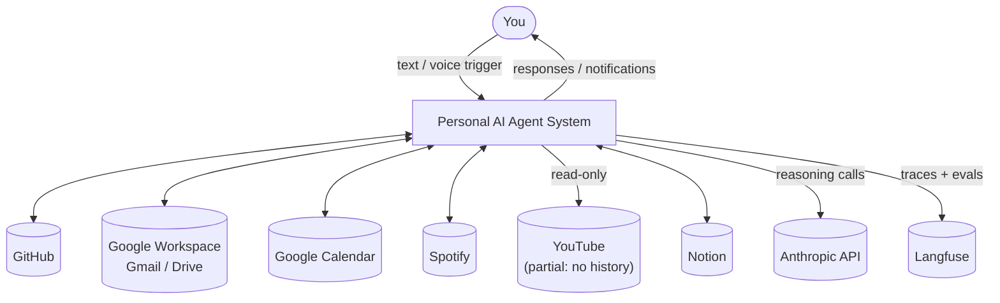
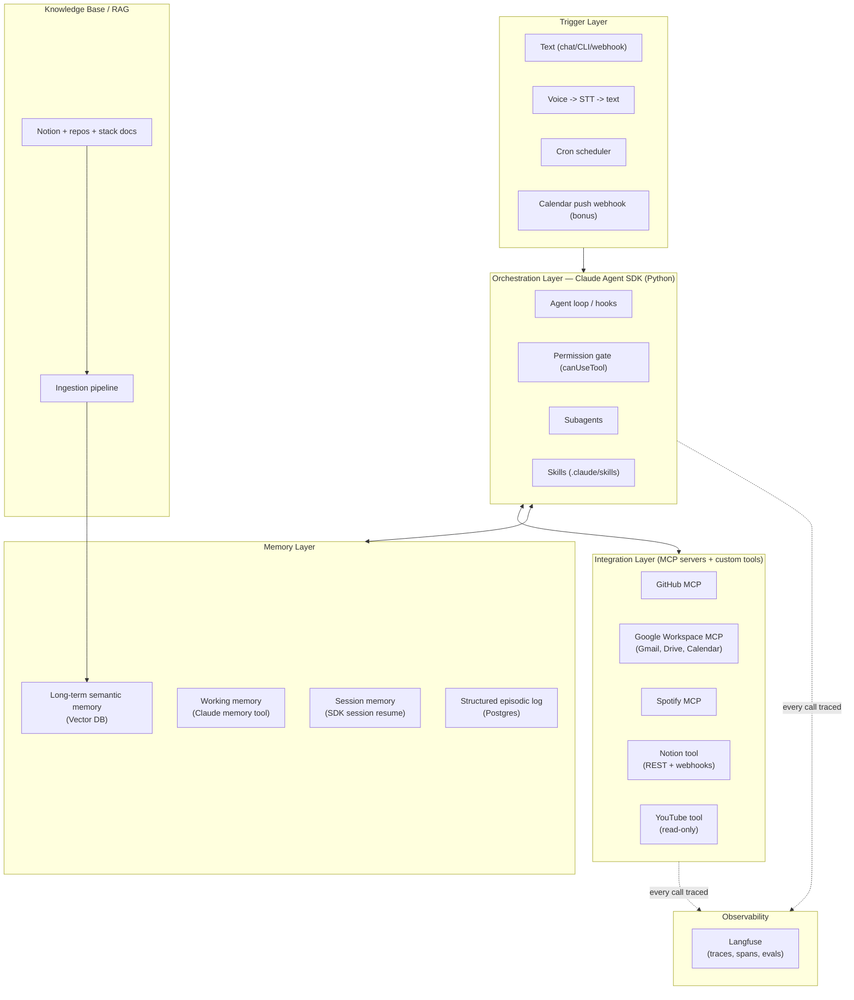
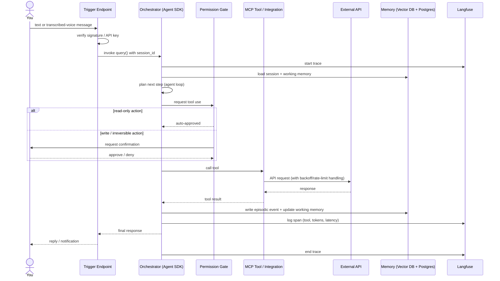
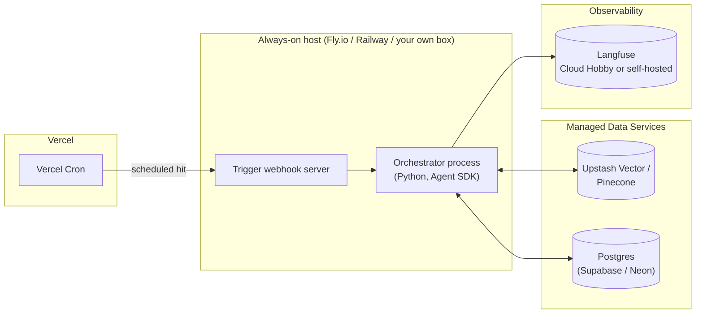
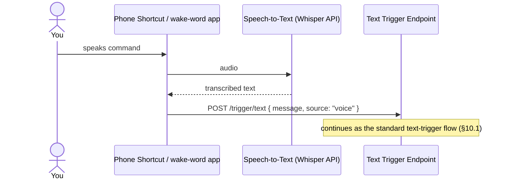
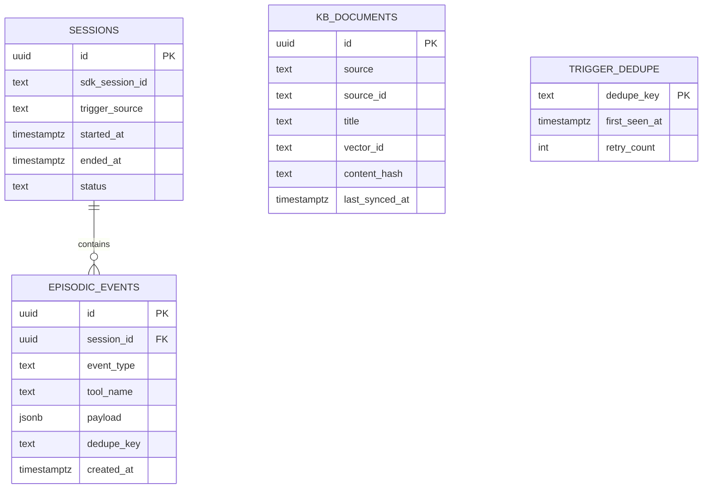
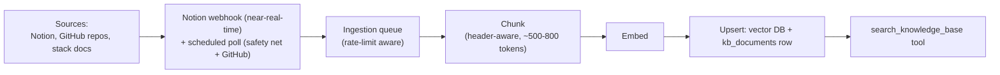
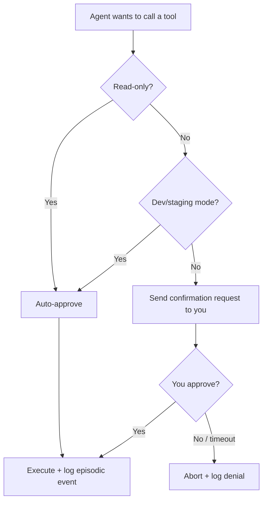

# Personal AI Agent

**Purpose:** Learn how production-grade agents are architected, by building a personal agent for yourself.
**Author:** You | **Drafted by:** Claude | **Status:** Draft v3

### Document Control

| Version | Changes |
|---|---|
| v1 | Initial draft — full feasibility matrix, single-layer architecture overview |
| v2 | Netflix/Prime descoped, Obsidian added, production-hardening patterns added |
| v3 | **Current.** Python confirmed. Notion replaces Obsidian. YouTube (partial) kept in scope. Restructured into formal HLD + LLD with diagrams |

---

## 1. Scope & Assumptions

| Item | Decision / Assumption |
|---|---|
| Language | **Python** (`claude-agent-sdk`) |
| Notes source | **Notion**, not Obsidian — changes the deployment story for the better (see §9) |
| YouTube | **In scope, partial** — liked videos, playlists, subscriptions only. No watch history is available from any API, by design of the platform, not a limitation of this build |
| Netflix / Prime Video | **Out of scope (v1)** — no viable API path exists for either |
| Task tracker (Linear/Todoist/Jira) | Not yet confirmed — flagged as an open question, not built into this version |
| "Augmented" | Interpreted as tool-augmented + retrieval-augmented (acts via tools/RAG, not just chats) |
| "Knowledge base of my entire stack" | Your dev/tooling stack — repos, configs, docs — plus your Notion workspace |
| Scale | Single user, low request volume — this relaxes a lot of "production" defaults, called out where relevant |
| Primary goal | Learning production agent patterns, not shipping a polished consumer product |

One naming note carried over from v1: **the "Claude Code SDK" was renamed the Claude Agent SDK** (`claude-agent-sdk` on PyPI for Python). It's a library — you host and run it yourself, in your own process. Docs: https://platform.claude.com/docs/en/agent-sdk/overview

---

## 2. Feasibility Matrix

| # | Requirement | Verdict | Notes |
|---|---|---|---|
| 1 | Claude Agent SDK (Python) as core | ✅ Doable | Hooks, subagents, MCP, permissions, sessions, skills, plugins all built in |
| 2a | GitHub context | ✅ Doable | Official GitHub API + official GitHub MCP server |
| 2b | Gmail context | ✅ Doable | Gmail API via OAuth; publish your OAuth consent screen to avoid the 7-day token expiry that applies to apps left in "Testing" mode |
| 2c | Google Drive context | ✅ Doable | Drive API via OAuth, typically bundled with Gmail in the same MCP server |
| 2d | Spotify context | ✅ Doable | Web API — currently-playing, recently-played (last 50 only), playlists, top tracks, library |
| 2e | YouTube context | ⚠️ Partial, by design | Data API v3 gives subscriptions, playlists, liked videos. **No watch history exists as an API concept** — the old endpoint has returned empty since ~2016 and there is no OAuth scope for it anywhere. This isn't something a better integration fixes |
| 2f | Netflix / Prime Video | 🚫 Descoped | No public API since 2014 (Netflix) / ever (Prime Video). Only path is a manual privacy-export request, not automatable |
| 2g | Notion context | ✅ Doable | REST API, internal integration token (no OAuth needed for single-workspace personal use), **now has webhooks** (shipped 2026) — see §11 |
| 3 | Long-term + session memory | ✅ Doable | Four-tier design — see §13 |
| 4 | Tool/RAG-augmented | ✅ Doable | Native via MCP + a custom retrieval tool |
| 5 | Knowledge base of your stack | ✅ Doable | Ingestion pipeline into the vector DB — see §14 |
| 6 | Skills | ✅ Doable | Agent SDK natively loads `SKILL.md` from `.claude/skills/` and `~/.claude/` |
| 7 | Vector DB, free tier, Vercel-friendly | ✅ Doable | Upstash Vector or Pinecone — both native Vercel Marketplace integrations |
| 8 | Trigger + schedule based invocation | ✅ Doable | External scheduler/webhook layer required — SDK has no built-in scheduler |
| 9a | Text trigger | ✅ Doable | Simple authenticated webhook |
| 9b | Voice trigger | ⚠️ Doable, extra hop | Claude's API takes text, not raw audio — needs an STT step first |
| 9c | Google Calendar as scheduler | ⚠️ Partial | Real interval scheduling should be actual cron; Calendar push notifications work as a *bonus* event-driven trigger, not the primary scheduler |
| 10 | Langfuse tracing, self-deployed | ✅ Doable, heavier than it sounds | Full self-hosted v3 needs Postgres + ClickHouse + Redis + S3-compatible storage — see §16 |

---

# PART A — HIGH-LEVEL DESIGN (HLD)

## 3. System Context


<details>
<summary>Mermaid source</summary>



</details>

The agent sits between you and seven external systems. Everything it does is either a reaction to something you (or your calendar) triggered, or a scheduled sweep — there is no autonomous background agency beyond what §16's permission tiers allow.

---

## 4. High-Level Architecture



**Why this shape:** the orchestrator never talks to Gmail/Spotify/Notion directly — everything routes through the integration layer, so each source is swappable and independently testable. Memory is split into four tiers because they solve four different problems (§13). Every call, in every layer, is traced through Langfuse.

---

## 5. Component Responsibility Summary

| Component | Responsibility | Owns |
|---|---|---|
| Trigger layer | Accept text/voice/scheduled input, authenticate it, hand it to the orchestrator | Webhook auth, STT hop, cron definitions |
| Orchestrator | Run the agent loop: plan, call tools, decide when done | Session state, permission decisions, hook execution |
| Integration layer | Talk to external APIs, normalize responses into tool results | OAuth/token handling per service, rate-limit backoff |
| Memory layer | Persist and retrieve state across turns and sessions | Vector DB, Postgres, memory-tool files |
| Knowledge base | Keep a searchable, current copy of your stack + Notion | Ingestion pipeline, chunking, embeddings |
| Observability | Make every decision inspectable after the fact | Langfuse traces, eval datasets |

---

## 6. Technology Stack Summary

| Layer | Choice | Why |
|---|---|---|
| Orchestration | Claude Agent SDK (Python) | Native hooks/subagents/skills/MCP/permissions |
| Trigger/webhook host | Small always-on VM (Fly.io / Railway) or a cloud VM | Long tool-calling loops don't fit serverless timeouts (§9) |
| Scheduling | Vercel Cron or GitHub Actions scheduled workflow | Free, no extra infra, fires the trigger endpoint |
| Vector DB | Upstash Vector (primary) or Pinecone Starter | Both native Vercel Marketplace integrations, usable free tier |
| Structured store | Postgres (Supabase or Neon free tier) | Episodic log, dedupe table, KB document index |
| STT | Whisper API (or equivalent) | Only practical way to get voice into a text-only agent input |
| Observability | Langfuse Cloud Hobby, or self-hosted compose | Native Anthropic SDK instrumentation |

---

## 7. End-to-End Data Flow (generic trigger → response)



**Voice adds one hop before this diagram starts:** phone Shortcut/wake-word app → Whisper API → transcribed text → the trigger endpoint above, unchanged from there.

---

## 8. Deployment Topology



**Note on the v2 → v3 change:** v2 flagged a hard choice between running the orchestrator on a home machine (for Obsidian's local vault) or adding sync plumbing to a cloud VM. **Notion removes that constraint entirely** — it's a cloud API like everything else now, so there's no local-filesystem dependency forcing your hand. A small always-on cloud VM is the simpler default unless you already have a home server running for other reasons.

---

# PART B — LOW-LEVEL DESIGN (LLD)

## 9. Orchestration Layer (Agent SDK, Python)

**Process model:** one long-running Python process (not a serverless function) hosting the trigger webhook server and the Agent SDK client. A single process is enough at personal scale — no need for a job queue/worker split yet.

**Session lifecycle:**

| Event | Behavior |
|---|---|
| New trigger, no existing session for the context (e.g. "morning digest") | Start a fresh SDK session |
| Follow-up within the same conversation/task | Resume the existing `session_id` |
| Task spans multiple days (e.g. "keep researching X") | Fork a session at a checkpoint so the original stays resumable |
| Context approaching the clearing threshold | Memory-tool write triggered automatically (per Anthropic's context-editing behavior) before old tool results are cleared |

**Directory layout:**

```
agent/
├── main.py                 # trigger webhook server + SDK client wiring
├── .claude/
│   ├── skills/
│   │   ├── triage-inbox/SKILL.md
│   │   ├── weekly-github-digest/SKILL.md
│   │   ├── notion-capture/SKILL.md
│   │   └── spotify-mood-playlist/SKILL.md
│   ├── hooks/
│   │   └── permission_gate.py
│   └── subagents/
│       └── researcher.py
├── tools/                  # custom (non-MCP) tools, e.g. Notion client, memory writer
├── mcp_servers.json        # MCP server registrations (GitHub, Google Workspace, Spotify)
└── memories/                # Claude memory-tool working directory
```

**Permission gate contract** (`canUseTool` callback — conceptual signature, not implementation):

| Input | Output |
|---|---|
| Tool name, arguments, classified risk tier (read / write / destructive) | `allow`, `deny`, or `ask` (blocks on your confirmation via the trigger channel) |

Risk-tier classification is a static table you maintain per tool (e.g. `gmail.search` → read, `gmail.send` → ask, `notion.delete_page` → ask), not something the model decides about itself.

---

## 10. Trigger Layer

### 10.1 Text trigger

| Field | Spec |
|---|---|
| Endpoint | `POST /trigger/text` |
| Auth | HMAC signature or bearer API key, checked before touching the SDK |
| Request body | `{ "message": string, "source": "manual" \| "shortcut" \| "bot", "session_hint": string? }` |
| Response | `{ "session_id": string, "reply": string, "trace_url": string }` |

### 10.2 Voice trigger



### 10.3 Cron-scheduled jobs

| Job | Frequency | What it does |
|---|---|---|
| Morning digest | Daily | Summarize overnight email/GitHub activity, post to your text channel |
| Notion incremental sync | Every few hours (safety-net poll alongside webhooks — see §11.3) | Catch any Notion changes the webhook missed |
| GitHub/repo re-index | Daily | Refresh knowledge-base embeddings for changed files |
| Calendar watch renewal | Every ~25 days | Google Calendar push-notification channels expire at 30 days — renew before that |
| Memory hygiene | Weekly | Expire/archive old episodic events and stale vector entries per your retention policy (§16) |

### 10.4 Calendar push webhook (bonus trigger)

Registered via the Calendar API's `watch()` call. On event create/update, Google POSTs a near-empty notification (not the event content) to your webhook — the handler then makes a follow-up `events.get` call to fetch details before deciding whether to act. Treat this purely as an *additional* trigger layered on top of §10.3's cron, per the feasibility matrix (§2, item 9c).

---

## 11. Integration Layer

| Integration | Access method | Auth | Key scopes / tools | Write actions gated? |
|---|---|---|---|---|
| GitHub | Official GitHub MCP server | GitHub App or PAT | repo, issues, PRs (read); comment/PR-create (write) | Yes |
| Gmail | Google Workspace MCP | OAuth 2.0 (Desktop app client) | `gmail.readonly` default; `gmail.send` only if needed | Yes |
| Google Drive | Google Workspace MCP | OAuth 2.0 | `drive.readonly` default | Yes |
| Google Calendar | Google Workspace MCP | OAuth 2.0 | `calendar.readonly` + `calendar.events` for the watch channel | Yes (event creation) |
| Spotify | Community Spotify MCP | OAuth 2.0 (Authorization Code) | `user-read-currently-playing`, `user-read-recently-played`, `playlist-read-private` | N/A (read-only use case) |
| Notion | Custom tool or lightweight MCP (see §11.1) | Internal integration token | Page/database read; page create/update (write) | Yes |
| YouTube | Google API client, separate OAuth scope | OAuth 2.0 | `youtube.readonly` — liked videos, playlists, subscriptions only | N/A (read-only) |

### 11.1 Notion — integration deep dive

This is worth its own subsection because the Notion API changed significantly through 2026 and the details affect the design:

- **Auth:** for a single-workspace personal agent, an **internal integration token** is simpler than OAuth — no consent flow, just a token from Notion's integration settings. The trade-off is Notion's permission model: the integration only sees pages/databases you've explicitly *shared with it*. Practical fix — create one top-level "Agent Access" page, share that with the integration, and organize everything the agent should see as children of it, so new pages inherit access instead of needing to be shared one by one.
- **Data model:** since the 2025-09-03 API version, a Notion "database" is a container that can hold multiple **data sources** — most query/write calls now need a `data_source_id`, fetched via a lookup call, not just the `database_id` you'd expect from older docs or tutorials. Build the Notion tool against the current API version from day one; don't copy a pre-2025 code sample.
- **Rate limit:** ~3 requests/second average per integration, with 429s on bursts — and because reading one page fans out into several calls (page → block children → nested blocks), a real sync of a non-trivial workspace needs a small request queue with exponential backoff, not naive sequential calls.
- **Sync strategy:** Notion shipped webhooks in 2026 (automation webhooks in January, full API webhooks with signature verification in March). Use **API webhooks as the primary sync trigger** into the knowledge-base ingestion pipeline (§14), with the daily poll from §10.3 as a safety net — webhook payloads are sparse (they tell you *something* changed, not *what*), so every webhook event still triggers a follow-up fetch of the changed page.

### 11.2 YouTube — integration deep dive

- **Scope:** `youtube.readonly` is sufficient for everything in scope.
- **What's available:** subscriptions, playlists (including the still-functional Liked Videos playlist), playlist items.
- **What's not available, structurally:** watch history. There is no endpoint and no OAuth scope for it — this has been true since roughly 2016 and isn't a gap this build can close. If watch-history-based personalization matters to you later, the only path is a periodic manual Google Takeout export, imported as a batch file, kept separate from the live-sync integrations above.
- **Quota:** the default daily quota (10,000 units) is generous for personal-scale read calls; not a practical constraint here.

---

## 12. Memory Layer

Four tiers, each solving a different problem — don't collapse this into "one vector DB":

| Tier | Holds | Mechanism | Lifespan |
|---|---|---|---|
| Session memory | Current conversation/task state | Agent SDK session resume/fork | One session |
| Working memory | Scratchpad surviving context compaction | Claude memory tool (file-based, client-controlled) | Until task completes |
| Long-term semantic memory | "What do I know about X" — similarity search | Vector DB | Indefinite (subject to §16 retention policy) |
| Structured episodic log | Exact record of what the agent did, when | Postgres | Indefinite (subject to §16 retention policy) |

### 12.1 Postgres schema



- `EPISODIC_EVENTS.dedupe_key` and the `TRIGGER_DEDUPE` table together implement the idempotency pattern from §17 — every write-tier action checks this before executing.
- `KB_DOCUMENTS.content_hash` lets the ingestion pipeline (§14) skip re-embedding unchanged content on the safety-net poll.

### 12.2 Vector DB design

| Field | Purpose |
|---|---|
| `id` | Matches `kb_documents.vector_id` |
| `embedding` | Content vector |
| `metadata.source` | `notion` \| `github` \| `stack_docs` — lets the retrieval tool filter by source |
| `metadata.updated_at` | Supports recency-weighted retrieval |
| `metadata.tags` | Notion tags/GitHub topics, carried through for filtered search |

One namespace/collection is enough at personal scale — filter by `metadata.source` rather than splitting into multiple indexes.

### 12.3 Memory-tool directory layout

```
memories/
├── preferences.md       # standing preferences learned over time
├── active-tasks/
│   └── <task-id>.md     # scratch state for in-flight multi-step tasks
└── decisions-log.md     # notable decisions made, for future-session context
```

---

## 13. Knowledge Base / RAG Pipeline



**Retrieval tool contract:**

| Input | Output |
|---|---|
| `query: string`, `source_filter?: string`, `top_k?: int` | Ranked list of `{ text, source, title, url, score }` |

Exposed to the orchestrator as a single tool rather than injecting the whole KB into context every turn — the agent decides when it needs to look something up.

---

## 14. Observability (Langfuse)

| What's traced | Where it shows up |
|---|---|
| Every orchestrator turn | Trace, named `<trigger_source>:<session_id>` |
| Every tool call | Span, tagged with tool name, risk tier (§17), latency, tokens |
| Permission-gate decisions | Span metadata — auto-approved vs. asked vs. denied |
| Retrieval calls | Span with query + returned doc IDs, for judging retrieval quality later |

**Eval dataset (§17):** a small, hand-curated set of `(trigger, expected tool calls / expected classification)` pairs, re-run through Langfuse's eval feature whenever a skill or prompt changes — this is what catches silent regressions that tracing alone won't show you.

**Deployment choice, recap from v1/v2:** Langfuse Cloud Hobby (free, 50K units/month) unless standing up the self-hosted Postgres+ClickHouse+Redis+S3 stack is itself part of what you want to learn.

---

## 15. Security & Permission Tiers



| Secret | Stored in | Never |
|---|---|---|
| OAuth tokens (Gmail, Drive, Calendar, Spotify, YouTube) | Secrets manager (Vercel encrypted env vars / Doppler / 1Password CLI) | Committed to a repo, logged in plaintext |
| Notion internal integration token | Same secrets manager | Shared beyond the pages you explicitly grant it |
| Trigger webhook signing key | Same secrets manager | Reused across services |
| Anthropic API key | Same secrets manager | Embedded client-side anywhere |

**Threat model, briefly:** the realistic risks here are (1) the trigger webhook being hit by someone other than you, mitigated by the signature check in §10.1; (2) a compromised or over-scoped OAuth token being used for actions beyond what you intended, mitigated by minimal scoping + the permission gate in §9; (3) sensitive email/note content persisting indefinitely in the vector DB, addressed by the retention policy below. This is not a multi-tenant system, so the bigger production concerns (tenant isolation, injection from other users) don't apply — but prompt injection *from content the agent reads* (a malicious email or Notion page instructing the agent to do something) is still a real risk worth keeping in mind as you write skills and tool descriptions.

**Retention policy (default, adjust as you like):** episodic events older than 90 days archived/deleted; vector entries refreshed on each KB sync rather than growing unbounded; no email/note content embedded verbatim without at least considering whether it should be summarized first.

---

## 16. Production Hardening Patterns (recap)

Carried forward from v2, now mapped to the LLD sections that implement each one:

| Pattern | Implemented in |
|---|---|
| Eval / regression harness | §14 (Langfuse eval dataset) |
| Permission tiers / human-in-the-loop | §9 (permission gate), §15 (decision flow) |
| Dev/staging mode | §15's permission flowchart branches on it explicitly |
| Cost & rate-limit guardrails | Wrap `query()` calls with a daily spend cap; Notion/GitHub calls go through the queue in §11.1/§13 |
| Idempotency on triggers | §12.1 (`dedupe_key`, `trigger_dedupe` table) |
| PII-awareness in memory | §15's retention policy |

---

# PART C — DELIVERY PLAN

## 17. Suggested Build Order

1. **Foundations** — Agent SDK "hello world" (Python) with built-in tools, Langfuse Hobby tracing wired in from day one.
2. **Notion first** — internal integration token, no OAuth flow to build; proves the auth-token → integration-layer → KB pattern with the least setup of any source. Good place to exercise the permission gate on writes (page creation) before anything higher-stakes is involved.
3. **One more cloud integration, end to end** — GitHub, via its official MCP server, plus a text trigger and a cron job. This proves the full trigger → orchestrator → tool → trace loop from §7.
4. **Memory** — vector DB + memory tool + Postgres episodic log. Add the eval harness here, while the surface area is still small.
5. **Knowledge base** — ingestion pipeline for Notion + repos + stack docs, exposed as the retrieval tool.
6. **Remaining cloud integrations** — Gmail, Drive, Calendar, Spotify, then YouTube (partial) last, since it's the lowest-value/highest-friction of what's left. Add dev/staging mode and cost guardrails before Gmail specifically, given write-access risk.
7. **Voice trigger** — STT hop + Calendar push webhook as the bonus trigger. Add idempotency handling here, since this is where duplicate triggers become a real risk.
8. **Skills, subagents, hooks, plugins** — refactor recurring workflows into Skills once you know which ones you actually run repeatedly.

---

## 18. Rough Cost Shape

Order-of-magnitude, not a bill:

- **Claude API** (official rates, Aug 2026): Sonnet 5 at $2/$10 per million input/output tokens for the agent's reasoning; route cheap/high-volume classification (e.g. "is this email urgent?") to Haiku 4.5 at $1/$5; reserve Opus 5 ($5/$25) for tasks that need the extra depth.
- **Notion, GitHub, Google Workspace, Spotify, YouTube APIs:** $0 — all free at personal usage volume.
- **STT (Whisper API):** a few cents per minute of audio — negligible at personal trigger volume.
- **Vector DB:** $0 on Upstash Vector's or Pinecone's free tier.
- **Postgres:** $0 on Supabase/Neon free tier.
- **Langfuse:** $0 on Hobby cloud tier; a few dollars/month in compute if self-hosting.
- **Orchestrator host:** $5–10/month (Fly.io/Railway) if you don't already have an always-on machine.

---

## 19. Risks & Open Questions

| # | Item | Why it matters |
|---|---|---|
| 1 | Task tracker (Linear/Todoist/Jira) | Still unconfirmed — worth settling before build so it's not a scope gap you hit mid-project |
| 2 | Orchestrator host choice | Fly.io vs. Railway vs. an existing machine — doesn't block design, does block §17 step 1 |
| 3 | Notion workspace structure | Whether you're willing to organize pages under one shared "Agent Access" root (§11.1) affects how much manual sharing you'll do as the workspace grows |
| 4 | Confirmation channel for the permission gate (§9, §15) | "Ask" decisions need somewhere to actually reach you — same text channel as triggers, or something else (push notification, Telegram)? |
| 5 | Retention policy defaults (§15) | 90-day episodic retention is a placeholder — confirm it matches how far back you'd actually want the agent recalling things |

Once these are settled, I can turn §17 into an actual sprint-by-sprint backlog with concrete task lists per phase — still no code until you ask for it.